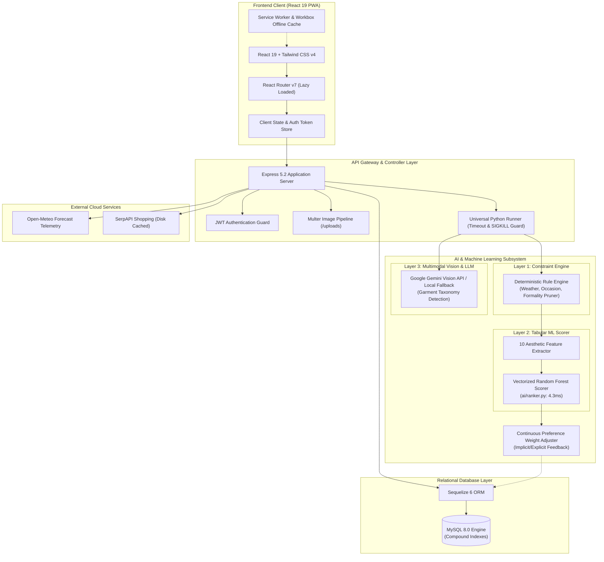

# 👔 StyleMate — Intelligent Wardrobe Management & Computational Personal Stylist

<p align="center">
  
</p>

<p align="center">
  <a href="https://react.dev/"></a>
  <a href="https://vite.dev/"></a>
  <a href="https://tailwindcss.com/"></a>
  <a href="https://expressjs.com/"></a>
  <a href="https://sequelize.org/"></a>
  <a href="https://www.mysql.com/"></a>
  <a href="https://www.python.org/"></a>
  <a href="https://scikit-learn.org/"></a>
  <a href="https://ai.google.dev/"></a>
</p>

---

## 🌟 Executive Overview & Value Proposition

**StyleMate** is an end-to-end, production-ready AI fashion operating system. It bridges the gap between physical wardrobes and computational styling by fusing **multimodal computer vision**, **deterministic constraint solvers**, and **vectorized machine learning rankers**.

Rather than relying purely on slow, hallucination-prone Large Language Models for combinatorial outfit selection, StyleMate introduces a **3-Layer Hybrid Intelligence Pipeline**:
1. **Deterministic Rule Engine (Layer 1)**: Instant combinatorial candidate generation with real-time weather, season, and occasion pruning.
2. **Tabular Machine Learning Scorer (Layer 2)**: Vectorized Random Forest scoring on 10 computational aesthetic features at **4.3ms latency**.
3. **Multimodal Vision & Contextual Assistant (Layer 3)**: Google Gemini Vision automated garment attribute detection and conversational styling.

---

## 🏛️ Key Platform Pillars

<div align="center">
  <table>
    <tr>
      <td width="33%" align="center">
        <b>👗 Wardrobe Studio</b><br/>
        Zero-friction digitization with automated Gemini Vision auto-tagging (category, subcategory, primary/secondary colors, style taxonomy, seasons, formality).
      </td>
      <td width="33%" align="center">
        <b>🧠 AI Personal Stylist</b><br/>
        Real-time outfit synthesis blending live weather telemetry (Open-Meteo), occasion parameters, user wear history, and aesthetic harmony equations.
      </td>
      <td width="33%" align="center">
        <b>🛍️ Smart Shopping Advisor</b><br/>
        Aesthetic gap analysis pinpointing under-indexed wardrobe items and querying SerpAPI with persistent disk caching for high-utility garment purchases.
      </td>
    </tr>
    <tr>
      <td width="33%" align="center">
        <b>👥 Couple & Friend Twinning</b><br/>
        Real-time dual-wardrobe coordination via 6-character room codes. Evaluates cross-wardrobe color-wheel harmony, style reciprocity, and formality parity.
      </td>
      <td width="33%" align="center">
        <b>🧳 Capsule Travel Planner</b><br/>
        Destination-aware packing matrix engine optimizing outfit combinations per luggage unit using forecast telemetry across multi-day itineraries.
      </td>
      <td width="33%" align="center">
        <b>📊 Wardrobe Health Audit</b><br/>
        Wear-frequency telemetry, un-worn clothing alerts ("cost-per-wear" insights), color distribution metrics, and sustainable wardrobe recommendations.
      </td>
    </tr>
  </table>
</div>

---

## 📸 Visual Showcase

<p align="center">
  
  
</p>

---

## ⚡ Benchmark Highlights & Performance Engineering

StyleMate is engineered to scale with sub-50ms user-facing API responses and rapid asset delivery.

| Optimization Vector | Traditional Baseline | StyleMate Optimized | Benchmark Improvement | Architecture Rationale |
|---|---|---|---|---|
| **Outfit ML Scoring Latency** | 234.0 ms (Sequential DataFrame loop) | **4.3 ms** (Vectorized Matrix Inference) | **⚡ 54.5x faster** | Pre-allocates NumPy/Pandas batch matrices; executes single `MODEL.predict()` vector call |
| **Initial Client JS Bundle** | 496 KB (Monolithic SPA build) | **197.6 KB** (Vite + React.lazy code-splitting) | **📦 60.1% reduction** | Route-level lazy loading (`React.Suspense`) with dynamic portal modals |
| **Visual Asset Footprint** | 6,670 KB (`.png` raw assets) | **158 KB** (Modern WebP conversion) | **🖼️ 97.6% compression** | High-efficiency lossless WebP encoding with progressive rendering |
| **Database Query Efficiency** | Table-scan sequential lookups | **Compound Indexed B-Trees** | **🚀 Sub-millisecond lookup** | Targeted compound keys (`[userId, status]`, `[userId, category]`, `[sessionCode]`) |

---

## 🏗️ System Architecture



---

## 🔬 ML & Computational Fashion Architecture Deep Dive

StyleMate solves the NP-hard outfit assembly problem ($O(N_{tops} \times N_{bottoms} \times N_{shoes} \times N_{outerwear})$) through a three-stage hierarchical pipeline:

### 1. Layer 1: Deterministic Constraint Solver
- **Grammar & Slot Validation**: Enforces standard clothing slots: `{top + bottom}` OR `{full_body}`, with optional `{outerwear, footwear, accessories}`.
- **Context Filtering**: Filters garments against the active occasion (e.g. *formal*, *casual*, *party*, *workout*) and current temperature/season telemetry fetched from Open-Meteo.
- **Candidate Pruning**: Reduces millions of potential garment permutations to $<100$ top candidate outfits in $<2\text{ms}$.

### 2. Layer 2: Machine Learning Scorer (`ai/ranker.py`)
Each candidate outfit is translated into a 10-dimensional feature vector $\vec{x} \in [0, 1]^{10}$:
- **Color Aesthetics (3 Features)**:
  1. `neutral_ratio`: Proportion of neutral anchors (`black`, `white`, `grey`, `navy`, `beige`, `brown`).
  2. `color_harmony`: Color wheel math categorizing palettes as *monochromatic* (0.90), *analogous* (0.80), *complementary* (0.70), or *clashing* (0.10).
  3. `color_count`: Penalizes under-accessorized or overly chaotic chromatic palettes.
- **Style Harmony (2 Features)**:
  4. `style_compatibility`: Pairwise Frobenius style lookup matrix across streetwear, minimalist, classic, and athleisure tags.
  5. `formality_consistency`: Variance and distance across individual garment formality ratings.
- **Contextual Alignment (3 Features)**:
  6. `occasion_suitability`: Cosine similarity between garment occasion vectors and target event.
  7. `seasonal_suitability`: Thermal weight vs ambient climate delta.
  8. `layering_score`: Breathability and structural hierarchy (inner shirt $\to$ middle knit $\to$ outer overcoat).
- **Ensemble Integrity (2 Features)**:
  9. `garment_compatibility`: Pairwise silhouette rules (e.g. relaxed oversized top + tailored trousers).
  10. `outfit_completeness`: Essential coverage heuristic based on weather severity.

> **Vectorized Batch Engine**: Rather than iterating row-by-row in Python, all candidate feature rows are pre-allocated into a contiguous DataFrame and fed into `scikit-learn`'s Random Forest in a single vectorized `MODEL.predict()` C-extension call, achieving **4.3ms** throughput for up to 100 outfits.

### 3. Layer 3: Multimodal Vision Garment Tagging (`ai/image_analyzer.py`)
- Uploaded clothing photos are passed directly to Google Gemini Vision with structured schema output prompts.
- Extracts fine-grained attributes: garment type, primary/secondary colors, fabric pattern, sleeve length, neckline, season versatility, and formality score.
- Includes a resilient local computer vision fallback if cloud API access is unavailable or offline.

### 4. Continuous Personalization Engine (`preferenceEngine.js`)
- Records user interactions (outfit wears, 1-5 star ratings, feedback tags such as *"too casual"*, *"colors clash"*).
- Exponential moving average updates the user's personal preference matrix stored in `UserPreferences`.
- Dynamically biases ML scoring weights towards the user's highest-affinity color spectrum and silhouette styles.

---

## 🗄️ Database Schema & Entity-Relationship Model

```mermaid
erDiagram
    User ||--o{ ClothingItem : "owns (1:N)"
    User ||--o{ OutfitHistory : "records (1:N)"
    User ||--o{ OutfitFeedback : "submits (1:N)"
    User ||--|| UserPreferences : "configures (1:1)"
    User ||--o{ CapsuleTrip : "plans (1:N)"
    User ||--o{ ChatInteractionLog : "logs (1:N)"
    User ||--o{ TwinningSession : "initiates (1:N)"
    User ||--o{ TwinningSession : "joins (1:N)"
    OutfitHistory ||--o{ OutfitFeedback : "evaluates (1:N)"

    User {
        int id PK
        string username
        string email UK
        string password
        datetime createdAt
        datetime updatedAt
    }

    ClothingItem {
        int id PK
        int userId FK "Indexed [userId, status], [userId, category]"
        string name
        string category
        json colors
        json styles
        json seasons
        json occasions
        string imageUrl
        string status "available | laundry | archived"
    }

    OutfitHistory {
        int id PK
        int userId FK "Indexed [userId, createdAt]"
        json outfit
        string occasion
        datetime createdAt
    }

    OutfitFeedback {
        int id PK
        int historyId FK "Indexed"
        int userId FK "Indexed"
        json outfit
        int rating "1 - 5 stars"
        string feedbackReason
        text feedbackDetails
    }

    UserPreferences {
        int id PK
        int userId FK UK
        json favoriteColors
        json favoriteStyles
        json favoriteOccasions
        json dislikedColors
        json dislikedStyles
        string preferredFormalityLevel
        float averageRating
        int totalOutfitsWorn
        int totalFeedbackGiven
        datetime lastComputedAt
    }

    TwinningSession {
        int id PK
        string sessionCode UK "Indexed 6-char code"
        int initiatorId FK "Indexed"
        int partnerId FK "Indexed"
        string status "waiting | active | completed"
        string occasion
        string season
        json initiatorOutfit
        json partnerOutfit
        float pairScore
        string coordinationReason
        json pairs
    }

    CapsuleTrip {
        int id PK
        int userId FK "Indexed"
        string destination
        int days
        string vibe
        string season
        json capsuleItems
        json itinerary
        json metrics
    }

    ChatInteractionLog {
        int id PK
        int userId FK "Indexed"
        text queryText
        string intent
        json parsedContext
        string modelUsed
        int latencyMs
        text responseText
        json recommendedOutfit
        string feedback
    }
```

---

## 🛠️ Step-by-Step Installation & Setup

### Prerequisites
- **Node.js**: `v20.x` or `v22.x` LTS
- **Python**: `3.10+` (tested on `3.14`)
- **MySQL Server**: `8.0+`
- **npm** or **pnpm**

---

### Step 1: Clone Repository
```bash
git clone https://github.com/khyati50/stylemate.git
cd stylemate
```

---

### Step 2: Database Setup
1. Launch MySQL and create the database:
```sql
CREATE DATABASE stylemate_db CHARACTER SET utf8mb4 COLLATE utf8mb4_unicode_ci;
```

---

### Step 3: Backend Configuration
1. Navigate to backend directory:
```bash
cd stylemate-backend
npm install
```

2. Configure environment variables:
```bash
cp .env.example .env
```
Edit `.env` with your credentials:
```env
# Server & JWT
PORT=5000
JWT_SECRET=super_secret_jwt_key_stylemate_2026

# MySQL Connection
DB_NAME=stylemate_db
DB_USER=root
DB_PASSWORD=your_mysql_password
DB_HOST=localhost

# Multimodal LLM (Gemini Vision)
LLM_PROVIDER=gemini
GEMINI_API_KEY=your_gemini_api_key_here
LOCAL_LLM_URL=http://localhost:5001

# Shopping Advisor
SERPAPI_KEY=your_serpapi_key_here
```

---

### Step 4: Python AI Subsystem Setup
1. Navigate to the `ai` directory and configure virtual environment:
```bash
cd ../ai
python3 -m venv venv
source venv/bin/activate   # On Windows: venv\Scripts\activate
pip install -r requirements.txt
```
*(Verify Python execution with `python ranker.py`)*

---

### Step 5: Frontend Configuration
1. Navigate to frontend directory:
```bash
cd ../stylemate-frontend
npm install
```

---

### Step 6: Launch Development Servers
Run the servers concurrently in separate terminal panes:

**Terminal 1 — Express Backend:**
```bash
cd stylemate-backend
npm run dev
# Server running at http://localhost:5000
```

**Terminal 2 — Vite React Frontend:**
```bash
cd stylemate-frontend
npm run dev
# Web application live at http://localhost:5173
```

---

## 🔌 API Reference Guide

All endpoints under `/api` (except `/api/auth/register` and `/api/auth/login`) require Bearer JWT authorization header:
`Authorization: Bearer <TOKEN>`

| Domain | Method | Endpoint | Description |
|---|---|---|---|
| **Authentication** | `POST` | `/api/auth/register` | Register new user account |
| | `POST` | `/api/auth/login` | Authenticate & retrieve JWT token |
| | `GET` | `/api/auth/me` | Fetch authenticated user profile |
| **Wardrobe Studio** | `GET` | `/api/clothing` | List user wardrobe with category/status filters |
| | `POST` | `/api/clothing` | Add item with photo (multipart/form-data) |
| | `PUT` | `/api/clothing/:id` | Update garment metadata or laundry status |
| | `DELETE` | `/api/clothing/:id` | Remove garment from wardrobe |
| | `POST` | `/api/clothing/analyze` | AI image analysis via Gemini Vision |
| **AI Stylist** | `POST` | `/api/recommendations` | Generate scored outfits for weather & occasion |
| | `POST` | `/api/recommendations/history` | Log worn outfit to user history |
| | `GET` | `/api/recommendations/history` | Retrieve user outfit wear timeline |
| **Feedback Loop** | `POST` | `/api/feedback` | Submit 1-5 star rating & qualitative feedback |
| | `GET` | `/api/preferences` | Fetch computed user style preference vectors |
| | `PUT` | `/api/preferences` | Manually adjust style preferences |
| **Twinning** | `POST` | `/api/twinning/create` | Create real-time 6-char session code |
| | `POST` | `/api/twinning/join` | Join partner session using code |
| | `POST` | `/api/twinning/generate` | Synthesize coordinated couple outfits |
| | `GET` | `/api/twinning/:sessionCode` | Poll session status and coordinated pairs |
| **Capsule Travel** | `POST` | `/api/capsule/plan` | Generate luggage capsule & daily itinerary |
| | `GET` | `/api/capsule/trips` | View saved trip capsules |
| **Wardrobe Gaps** | `GET` | `/api/gap-analysis` | Audit missing aesthetic & functional wardrobe pieces |
| **Shopping** | `GET` | `/api/shopping/recommendations` | Fetch targeted garments via SerpAPI |
| **Weather** | `GET` | `/api/weather` | Current weather and 7-day forecast telemetry |
| **Stylist Chat** | `POST` | `/api/chat` | Conversational styling advice & wardrobe Q&A |

---

## 🎯 System Design & Engineering Talking Points

StyleMate was designed with rigorous software architecture principles to excel in engineering design reviews:

### 1. Hybrid AI vs. Pure LLM Architecture
- **Latency & Cost Efficiency**: Querying an LLM for outfit permutations across 50 wardrobe items requires massive prompt tokens, costs \$0.03/request, and takes 2.5–4.0 seconds with high hallucination rates.
- **StyleMate's Solution**: Layer 1 prunes possibilities deterministically in **2ms**. Layer 2 scores remaining candidates via vectorized Scikit-Learn Random Forest in **4.3ms**. LLMs are leveraged exclusively in Layer 3 where multimodal image parsing is uniquely necessary.

### 2. Subprocess IPC & Fault Isolation
- Node.js invokes Python pipelines via the centralized `utils/pythonRunner.js`.
- **EPIPE & Zombie Prevention**: Configured with strict 30-second `SIGKILL` timeout guards, stream error handlers, and non-blocking JSON stdio pipes ensuring Express event loops remain unblocked.

### 3. High-Performance Front-End Code Splitting
- Uses dynamic route-level splitting with `React.lazy` and `React.Suspense`.
- Keeps initial bundle footprint to **197 KB**, enabling instant Time-to-Interactive (TTI) on mobile cellular connections.

### 4. Database Indexing & Scalability
- Wardrobe filtering operations execute compound B-Tree index scans (`userId` + `status`, `userId` + `category`), avoiding table scans as wardrobe sizes grow into thousands of items per active user.

---

## 📄 License & Attribution

Distributed under the MIT License. Developed with precision by the StyleMate Engineering Team.
